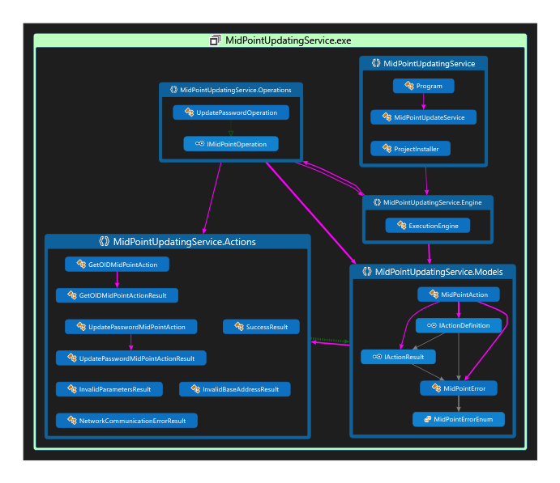

# midPoint Active Directory live password agent.

## Functional description

This ~~application~~ is built on top of the PoC from listens to AD password change requests using the filter and synchronizes the changes with midPoint using a Secure Persistent Queue.

## Components

- ADPasswordFilter.dll
- ADPasswordAgent.exe
- MidPointUpdatingService.exe

## Code compilation and instalation

Compile code of all projects, in the Release mode

###1/ Instalation of MidPointUpdatingService.exe

a/ Create service target folder on the target domain controller drive
b/ Copy all files form /bin/Release folder to the created target folder
c/ Edit the file MidPointUpdatingService.exe.config, and set up the settings parameters 
d/ Open VisualStudio Command Windows
e/ Issue in VS CMD : 
    CD {target folder}  
    installutil MidPointUpdatingService.exe
f/ An interactive dialog appears requesting the user account and the password for service account. Fill it in.
g/ Run Services.msc
h/ Find the service named MidPoint Updating Service and start it.

####Settings:

-MidPoint Base URL -  BASEURL
-MidPoint Account Username - AUTHUSR
-MidPoint Account Password - AUTHPWD
-MidPoint Queue Identifier - QUEUEFLD  (do not change the default setting m if there is not more then ome MIdpoint sznchronized from the same DC)
-Number of attempts on MidPoint call - RETRYCNT  (max 500 for performance reasons)
-Time in seconds to wait for queue availability - QUEUEWAIT  ( used for interprocess locking, change only to higher value if there are timeout exceptions of the agent in case of extreme load - 60 requests per second and above )
-Logging level 0-verbose to 4-error only - LOGLEVEL
-Log storage path - LOGPATH

###2/ Instalation of the Agent

a/ Create agent target folder on the target domain controller drive
b/ Copy all files form /bin/Release folder to the created target folder
c/ Create Windows Registry entry in folder HKLM\SOFTWARE\ADPasswordFilter, named Agent of type STRING, and the value {agent target folder}/ADPasswordAgent.exe

###3/ Instalation of the Filter

a/ Copy ADPAsswordFilter.dll form /bin/Release folder to the C:\Windows\SysWOW64 folder on domain controller
b/ Create Windows Registry entry in folder HKLM\SYSTEM\CurrentControlSet\Control\Lsa, named Notification Packages of type MULTISTRING, and the value ADPasswordFilter.dll

## Technical description

ADPasswordFilter.dll runs in the context of an AD Domain Controller and listens for AD password change requests.

ADPasswordAgent.exe encrypting the passwords and sending them as ActionCalls to the Secure Persistent Queue located in the Isolated Storage of the domain controller.

MidPointUpdatingService.exe is installed and registered as a service of Windows OS, running permanently checking for presence of an ActionCall in the queue. 
If any ActionCall is present, is executed against the configured MidPoint instance, and if not successfull, by the means of the recoverable error (eg. Network Connection error),
a couple of attempts is made to retry in a rising time delay. When non-recoverable error occures, the ActionCall is dequeued and released and the information is written to the log.

## ToDo
- [ ] Modify or rewrite the WIX installer - now the installer is not functional and the Manual setup process is required.
- [ ] In the case when MidPoint REST interface is returning the Success message on call, despite of returning OperationalResult structure with detail error (eg. too short password) 
the OperationalResult structure is not actually parsed to get those errors and the operatiion is reported as successful. For the next version recommending adding the 
OperationalResult parsing.

